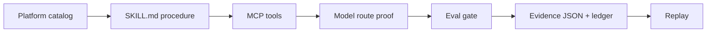
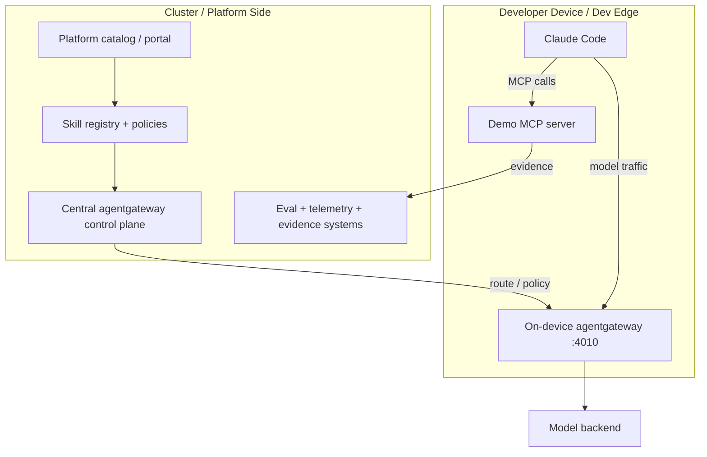

# AI-Native Platform Engineering

Build and run the closing demo from the talk: a governed AI platform action with `SKILL.md`, scoped MCP tools, model-route proof, eval gates, telemetry, and replayable evidence.

This audience version is intentionally standalone. It does not require a Kubernetes cluster, OpenChoreo install, VPN, Grafana, or private agentgateway setup.

It also documents the full talk topology: a cluster-side platform/control-plane path plus an on-device/dev-edge model gateway used by Claude Code.

## What You Will Run

The demo shows one platform action:



Default mode runs fully local and deterministic. It uses a local MCP server and creates real evidence files on disk. Optional live mode lets you connect Claude Code and your own model gateway.

## Two Ways To Use This Repo

| Track | What it proves | Requirements |
|---|---|---|
| Standalone audience demo | The control loop: skill, MCP, route proof, eval, evidence, replay | Bash + Node.js |
| Full topology | Cluster-owned route/control plane + on-device/dev-edge agentgateway for Claude Code | Kubernetes, agentgateway, Claude Code, model credentials |

The standalone demo keeps the same contracts but replaces the real cluster/data-plane wiring with local artifacts so anyone can run it.

## Full Talk Topology



In the talk, the important split is:

- The **cluster/platform side** owns capability state, policies, route intent, evals, telemetry, and evidence.
- The **device/dev-edge side** is where Claude Code runs and sends model traffic through a local governed route.
- `SKILL.md` tells the agent what procedure to follow.
- The demo MCP server gives the agent scoped platform tools instead of raw infrastructure access.

## Quick Start

Requirements:

- macOS, Linux, or WSL
- Bash
- Node.js 20+

Run:

```bash
git clone https://github.com/thiago4go/ai-native-platform-engineering.git
cd ai-native-platform-engineering
./scripts/run-demo.sh
```

The demo creates evidence under:

```text
harness/runs/evidence-records/
harness/runs/evidence-ledger.jsonl
```

Replay the latest evidence:

```bash
./scripts/replay-evidence.sh
```

## What Is Actually Happening

The local MCP server exposes three tools:

```text
platform.get_context
platform.get_eval_results
platform.record_evidence
```

The runner calls those tools, prints the MCP trace, writes an evidence record, writes route metrics, and replays the result. The point is not the specific service name. The point is the platform control loop.

## Optional Live Claude Code Run

If you have Claude Code installed and an Anthropic API key:

```bash
export ANTHROPIC_API_KEY=<your-anthropic-api-key>
./scripts/run-claude-code-demo.sh
```

To route Claude Code through your own gateway, set:

```bash
export ANTHROPIC_BASE_URL=http://127.0.0.1:4010
./scripts/run-claude-code-demo.sh
```

See [docs/live-claude-code.md](docs/live-claude-code.md).

For the full cluster + device architecture, see [docs/full-topology.md](docs/full-topology.md).
For the demo MCP tools, see [docs/demo-mcp.md](docs/demo-mcp.md).
For the visual explanation from the talk, see [docs/diagrams.md](docs/diagrams.md).

## Repository Layout

```text
catalog/                         platform capability catalog
skills/                          SKILL.md procedure
mcp/                             local MCP server and Claude config template
scripts/run-demo.sh              standalone audience demo
scripts/run-claude-code-demo.sh  optional live Claude Code demo
scripts/replay-evidence.sh       replay latest evidence record
docs/architecture.md             architecture notes
docs/build-your-own.md           how to adapt the pattern
docs/full-topology.md            cluster + device topology
docs/demo-mcp.md                 MCP tool contract and test calls
docs/diagrams.md                 Mermaid diagrams for the talk and demo
harness/runs/                    generated run artifacts
```

## Talk Thesis

Cloud-native platform engineering standardized how workloads run.

AI-native platform engineering must standardize how intelligent systems act:

```text
intent -> skill -> scoped tools -> governed model route -> eval -> telemetry -> evidence -> accountability
```

Agents should not get vague power. They should get governed paths.
