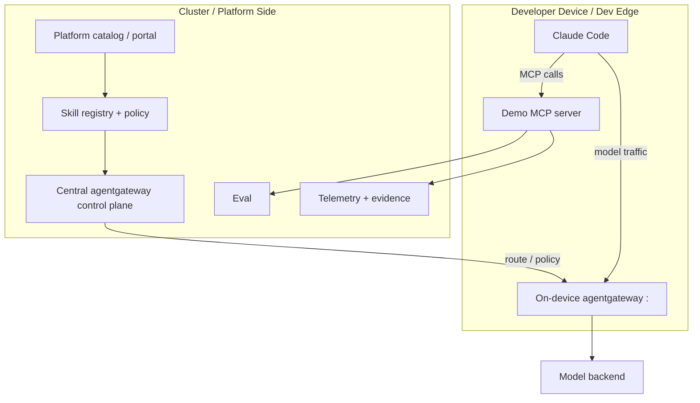
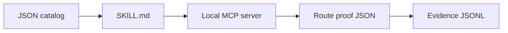
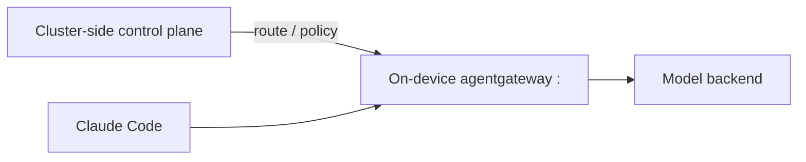

# Architecture

This repository demonstrates the control loop for AI-native platform engineering.

## Point Of View

Cloud-native platform engineering standardized how workloads are built, deployed, and operated. AI-native platform engineering adds a harder problem: the platform must now mediate intelligent execution.

The fundamental change is that agents, models, and tools can participate in the execution loop. The platform can no longer stop at templates, clusters, pipelines, and dashboards. It needs contracts for context, tool use, model routing, eval gates, telemetry, evidence, and accountability.

What must not change is the platform engineering discipline:

- product thinking
- golden paths
- security by default
- reliability
- ownership
- developer experience
- human accountability

In short:

```text
What changes: the platform becomes part of the execution loop.
What must not change: humans and organizations remain accountable.
```



## Platform Intelligence Layer

Enterprises with cloud-native platforms already have a strong base: Kubernetes, CI/CD, service catalogs, observability, and security controls. To become AI-native, the architectural shift is to add a Platform Intelligence Layer:

```text
data/context -> inference -> tool/action pathways -> telemetry/evidence
```

This layer answers the questions that matter when agents act:

- What context is the agent allowed to see?
- Which tools can it call?
- Which model route is approved?
- Which eval gate decides whether it can proceed?
- What telemetry proves the action happened safely?
- Where is the evidence recorded?
- Who owns the decision and the consequences?

Without this layer, every team builds its own prompts, tool access, model path, and risk model. That becomes a new form of platform fragmentation.

## Portal Versus Platform

A developer portal is the front door. The platform is the engine behind it.

A demo-friendly IDP can centralize links, templates, and metadata. An enterprise-grade IDP changes how work flows. It exposes strong abstractions backed by real platform capabilities: ownership, policy, lifecycle, observability, evidence, and safe execution paths.

In an AI-native platform, the catalog is not only documentation for humans. It becomes context and control surface for agents:

```text
capability -> skill -> tools -> route -> eval -> evidence
```

That is the difference between a nice developer experience and an operating model.

## Components

| Component | Purpose |
|---|---|
| Catalog | Platform-owned capability state |
| `SKILL.md` | Repeatable operating procedure for the agent |
| MCP server | Scoped tool boundary |
| Cluster-side agentgateway | Control-plane route ownership and policy distribution |
| On-device/dev-edge agentgateway | Local model traffic endpoint for Claude Code |
| Model route | Place to enforce route ownership, policy, and telemetry |
| Eval | Gate that decides whether action can proceed |
| Evidence ledger | Replayable proof of what happened |

## Standalone Mode Versus Full Topology

The default `./scripts/run-demo.sh` mode is a local simulation of the same contracts:



The full topology replaces the route proof with a real gateway path:



This split matters because it lets the platform own route intent and evidence while still letting a developer run Claude Code locally.

## Why This Matters

Without a platform path, teams tend to give agents raw tools, copied prompts, broad credentials, and private API keys.

With a platform path, the agent operates through explicit contracts:

```text
intent -> skill -> scoped tools -> route -> eval -> evidence -> accountable human
```

The underappreciated risk is not only that a model gives a bad answer. The deeper enterprise risk is unaccountable action: an agent does something and nobody can explain which context, tool, model route, policy, eval, or human approval boundary applied.

The platform should make that impossible by design.
