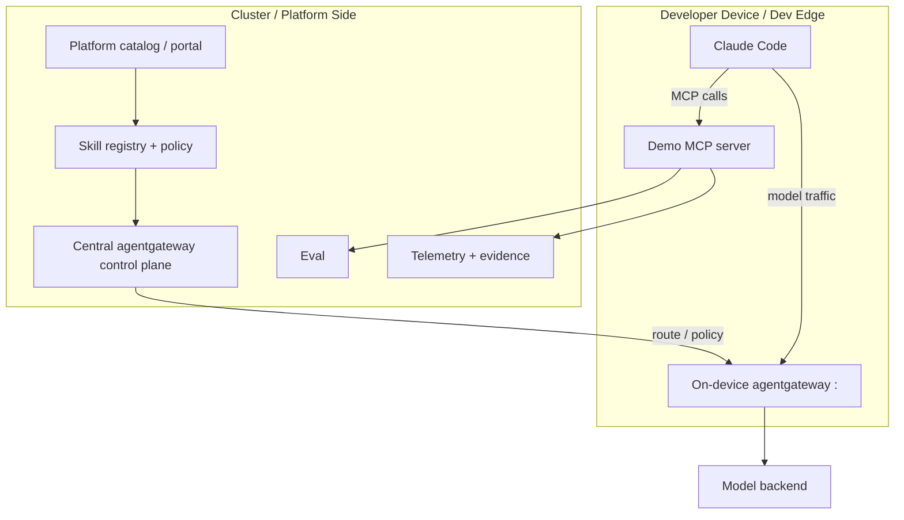
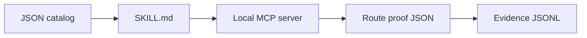
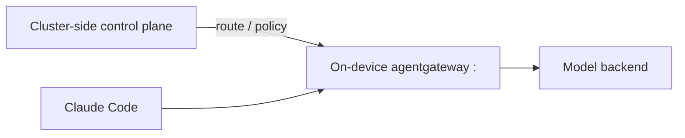

# Architecture

This repository demonstrates the control loop for AI-native platform engineering.



## Components

| Component | Purpose |
|---|---|
| Catalog | Platform-owned capability state |
| `SKILL.md` | Repeatable operating procedure for the agent |
| MCP server | Scoped tool boundary |
| Cluster-side agentgateway | Control-plane route ownership and policy distribution |
| On-device/dev-edge agentgateway | Local model traffic endpoint for Claude Code |
| Model route | Place to enforce route ownership, policy, and telemetry |
| Eval | Gate that decides whether action can proceed |
| Evidence ledger | Replayable proof of what happened |

## Standalone Mode Versus Full Topology

The default `./scripts/run-demo.sh` mode is a local simulation of the same contracts:



The full topology replaces the route proof with a real gateway path:



This split matters because it lets the platform own route intent and evidence while still letting a developer run Claude Code locally.

## Why This Matters

Without a platform path, teams tend to give agents raw tools, copied prompts, broad credentials, and private API keys.

With a platform path, the agent operates through explicit contracts:

```text
intent -> skill -> scoped tools -> route -> eval -> evidence -> accountable human
```
