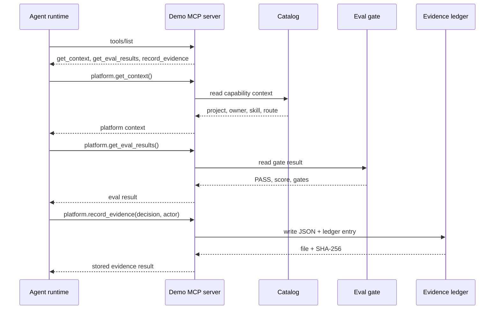

# Demo MCP

The demo MCP server is intentionally small. It represents the platform-facing tool boundary an agent should use instead of raw infrastructure access.

## Tools

```text
platform.get_context
platform.get_eval_results
platform.record_evidence
```

## Tool Contract

| Tool | Purpose | Result |
|---|---|---|
| `platform.get_context` | Read platform-owned capability state | project, owner, skill, route, backend |
| `platform.get_eval_results` | Read the eval gate | suite, pass/fail, score, gates |
| `platform.record_evidence` | Create durable evidence | stored file, ledger entry, SHA-256 |

## Sequence



## Run It Directly

The easiest way to see the MCP behavior is:

```bash
./scripts/run-demo.sh
```

The output includes:

```text
MCP LIST   platform.get_context, platform.get_eval_results, platform.record_evidence
MCP CALL   platform.get_context {}
MCP RESULT ...
MCP CALL   platform.get_eval_results {}
MCP RESULT ...
MCP CALL   platform.record_evidence {"decision":"promote_for_demo","actor":"ai-platform-publisher"}
MCP RESULT stored=true, file=..., sha256=...
```

## Why MCP Matters Here

MCP is not permission by itself. It is an interface.

The platform still needs:

- identity
- authorization
- route policy
- eval gates
- evidence
- human accountability

This repo keeps those concepts visible even in local mode.
