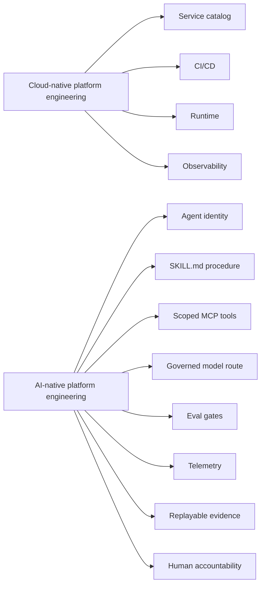
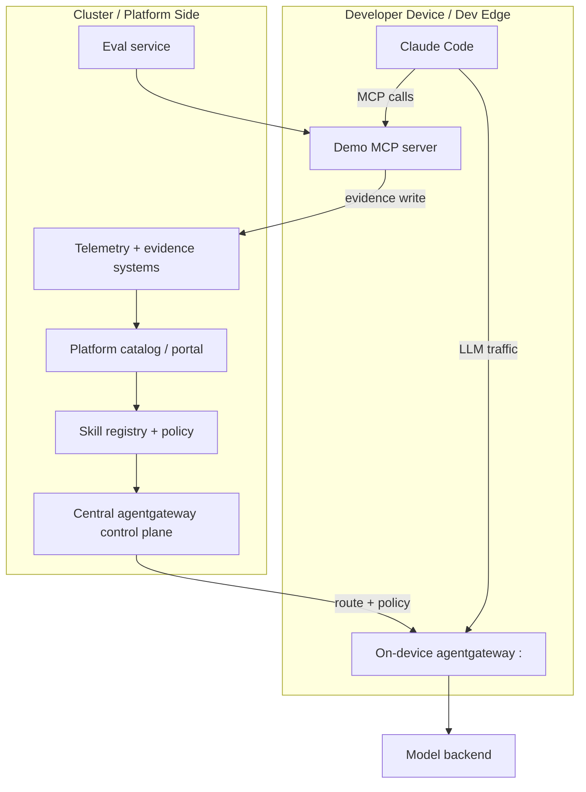
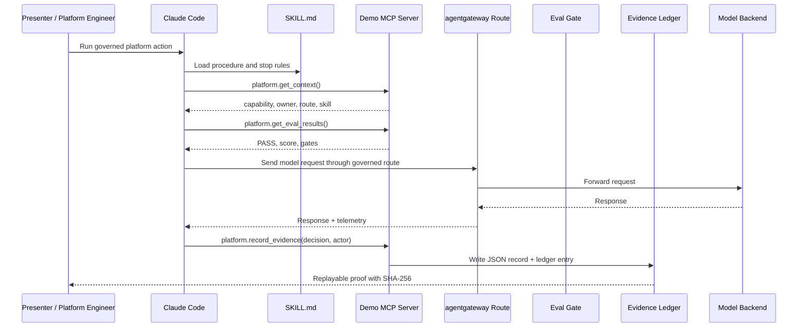
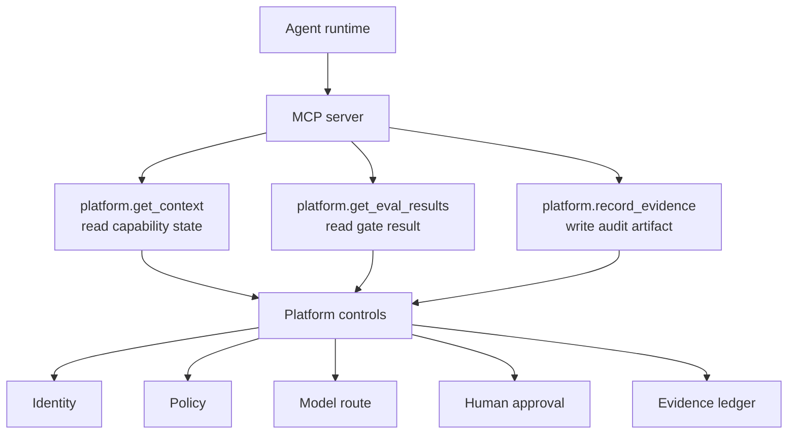
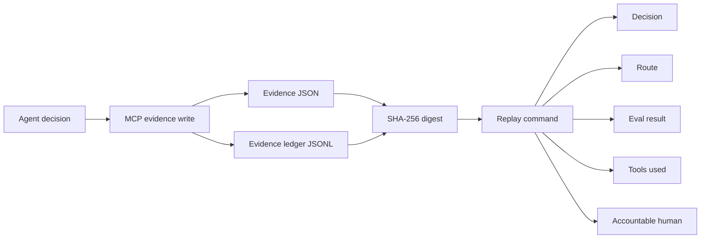
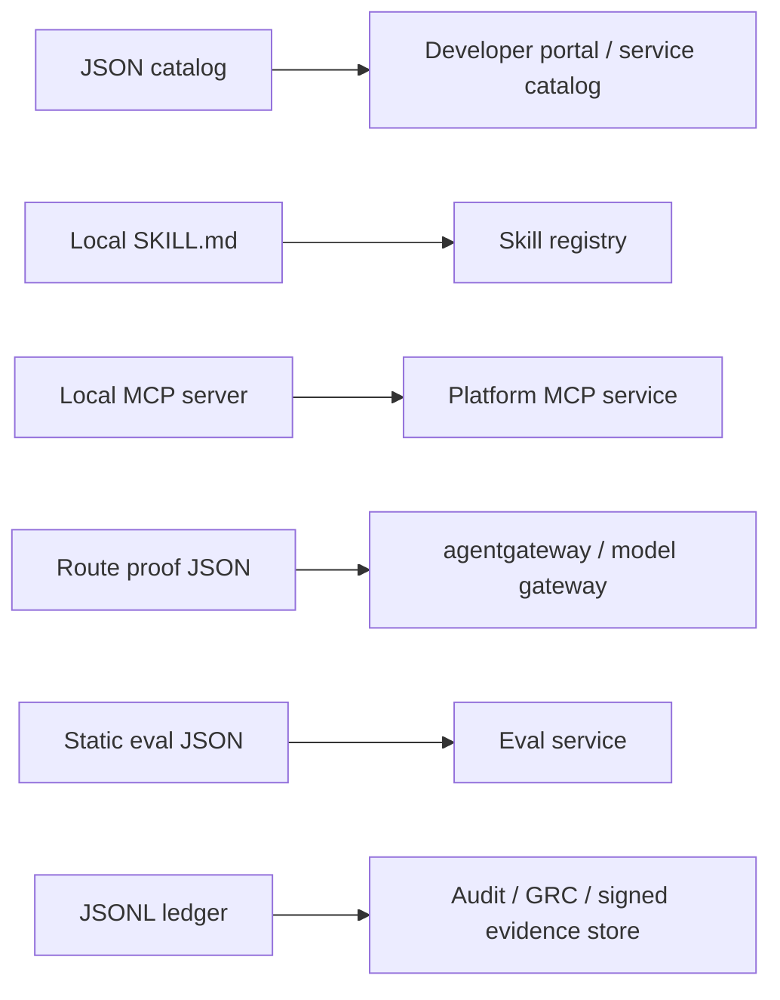

# Diagrams From The Talk

These diagrams explain the architecture and control loop behind the demo.

## 1. Talk Thesis

Cloud-native platforms standardized workload delivery. AI-native platforms need to standardize governed intelligent action.

## 2. Full Topology We Demonstrated

The talk demo used a split topology: platform ownership in the cluster, agent execution on the developer device.

## 3. What Happens In The Live Demo

This is the path the terminal demo reproduces.

## 4. MCP Is A Tool Boundary, Not A Permission Model

MCP gives the agent an interface. The platform still needs identity, authorization, route policy, evals, evidence, and human accountability.

## 5. Evidence Flow

The valuable outcome is not that the model answered. The valuable outcome is that the platform can replay what happened.

## 6. How To Adapt The Pattern

Use the local demo to teach the control loop, then replace each local artifact with your platform system.

